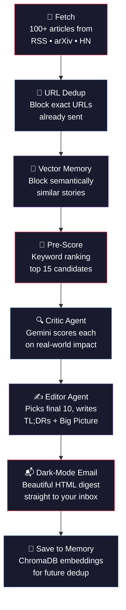
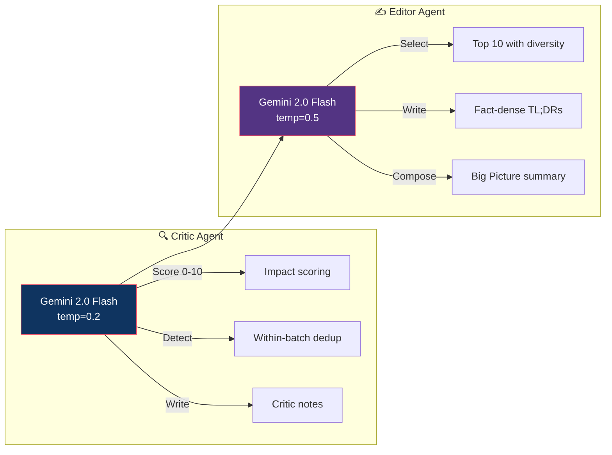

<div align="center">

# 🧠 AI Daily Digest

**Your personal AI news intelligence system — so you never miss what matters.**

[](https://python.org)
[](https://ai.google.dev)
[](https://trychroma.com)
[](LICENSE)

*A multi-agent system that reads 100+ AI sources, eliminates noise, and delivers a beautifully curated daily briefing to your inbox.*

</div>

---

## The Problem

You follow AI. So does everyone else. The result?

- 📰 **100+ articles/day** across TechCrunch, arXiv, Hacker News, company blogs…
- 🔄 **Same story, 8 sources** — "OpenAI raises funding" appears everywhere with different headlines
- 📉 **Signal-to-noise ratio approaching zero** — for every breakthrough paper, there are 50 "AI will change everything" opinion pieces
- ⏰ **No time to filter** — you're building AI systems, not reading about them

## The Solution

AI Daily Digest is a **multi-agent AI system** that does what a world-class editorial team would do — in 90 seconds:

> **Fetch → Deduplicate → Score → Curate → Write → Deliver**

Every morning, you get ONE email with 10 hand-picked stories, each with a sharp TL;DR, a "why it matters" note, and a big-picture executive summary tying them all together.

**No duplicates. No fluff. No clickbait.** Just the 10 things you actually need to know.

---

## How It Works



---

## Why Vector Memory Matters

Traditional dedup compares URLs or keywords. That fails:

| Headline A | Headline B | Keywords match? | Blocked? |
|---|---|:---:|:---:|
| "OpenAI expands enterprise push" | "OpenAI calls in consultants for corporate market" | ❌ | ❌ Old system |
| "Anthropic accuses Chinese labs" | "Claude scraped by Chinese AI companies" | ❌ | ❌ Old system |

**AI Daily Digest** uses **sentence-transformers** to embed article titles into a 384-dimensional vector space and checks **cosine similarity** against all previously sent articles:

```
Article: "OpenAI expands enterprise push"
   ↓ encode → [0.12, -0.34, 0.78, ..., 0.45]  (384 dims)
   ↓ cosine similarity vs stored embeddings
   ↓ similarity = 0.89 with "OpenAI calls in consultants for corporate market"
   ↓ 0.89 > 0.72 threshold → ❌ BLOCKED as duplicate
```

**Result:** Your readers never see the same story twice, even if it's told from a completely different angle.

---

## The Agent Architecture



Both agents have **built-in fallbacks** — if the Gemini API is rate-limited, the system gracefully degrades to keyword scoring without any reader-visible impact. No "service unavailable" messages, no broken emails.

---

## News Sources

| Source | Type | What we get |
|---|---|---|
| TechCrunch AI | 📰 News | Breaking industry stories |
| VentureBeat AI | 📰 News | Enterprise AI coverage |
| The Verge AI | 📰 News | Consumer AI products |
| MIT Technology Review | 📰 News | Long-form AI analysis |
| Ars Technica AI | 📰 News | Technical deep-dives |
| OpenAI Blog | 🏢 Company | Direct product announcements |
| Anthropic News | 🏢 Company | Claude updates, safety research |
| Google DeepMind Blog | 🏢 Company | Gemini, AlphaFold updates |
| arXiv (cs.CL + cs.AI) | 📄 Research | Latest papers, pre-prints |
| Hacker News | 💬 Community | What engineers are discussing |

---

## Project Structure

```
ai_news_digest/
│
├── run_digest.py              # 🎯 Pipeline orchestrator (8-step flow)
├── config.py                  # ⚙️ Feeds, keywords, thresholds
│
├── fetchers/                  # 📡 Data collection
│   ├── rss_fetcher.py         #    RSS/Atom feeds (10+ outlets)
│   ├── arxiv_fetcher.py       #    arXiv API (cs.CL, cs.AI)
│   └── hackernews_fetcher.py  #    HN top stories filtered by AI keywords
│
├── processor/                 # 🧠 Intelligence layer
│   ├── memory.py              #    URL dedup (JSON-based)
│   └── vector_memory.py       #    Semantic dedup (ChromaDB + MiniLM)
│
├── agents/                    # 🤖 AI editorial team
│   ├── critic_agent.py        #    Scores articles, detects duplicates
│   └── editor_agent.py        #    Curates final digest, writes TL;DRs
│
├── email_sender/              # 📬 Delivery
│   ├── composer.py            #    Dark-mode HTML email builder
│   └── sender.py              #    Gmail SMTP delivery
│
├── scheduler/                 # ⏰ Automation
│   └── setup_scheduler.py     #    Windows Task Scheduler setup
│
└── data/                      # 💾 Local state (gitignored)
    ├── memory.json            #    Seen URLs
    └── chroma_db/             #    Vector embeddings
```

---

## Tech Stack

| Component | Technology | Why |
|---|---|---|
| **LLM** | Gemini 2.0 Flash | Fast, cheap, JSON mode |
| **Embeddings** | `all-MiniLM-L6-v2` | 80MB, runs locally, zero API cost |
| **Vector DB** | ChromaDB | Local, persistent, cosine similarity |
| **Email** | Gmail SMTP + Jinja2 | Free, reliable delivery |
| **Scheduling** | Windows Task Scheduler | Set-and-forget daily runs |

---

<div align="center">

**Built with ❤️ by [DevinHansa](https://github.com/DevinHansa)**

*Stop scrolling. Start knowing.*

</div>
